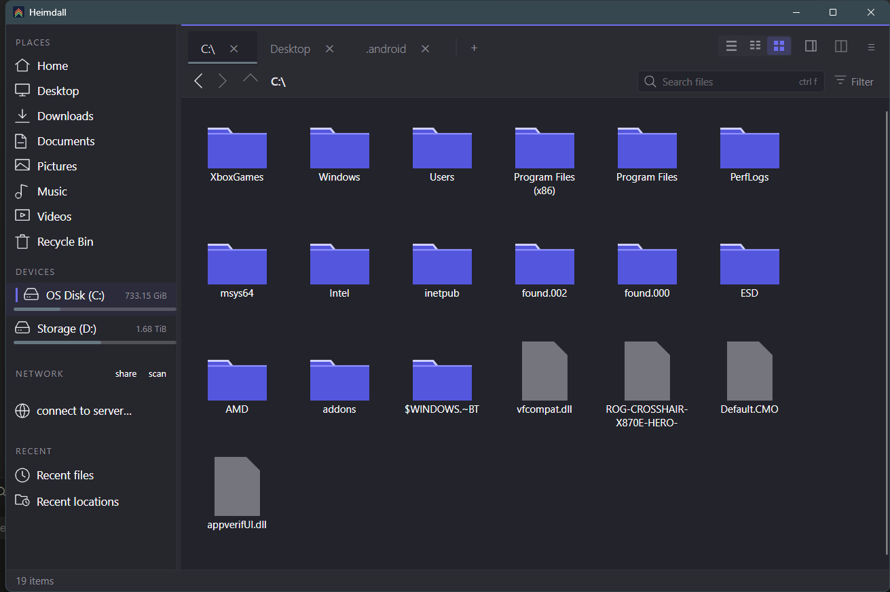

<div align="center">


# Heimdall

**A fast, keyboard-friendly file manager for Linux desktops.**

It reads your desktop's own settings — icon theme, click behaviour, trash,
bookmarks and file types — rather than keeping its own copy of them.

Colours and typeface are currently pinned to the design reference rather than
following your desktop; see [Fitting your desktop](#fitting-your-desktop).

</div>



<sub>Grid view at the filesystem root.</sub>

---

## Getting around

**Tabs and split view.** Open as many tabs as you like, and press `F3` to split
the window in two. Each side keeps its own tabs, history, selection and zoom
level, so you can compare two folders without either side forgetting where it was.
Copy or move between them from the right-click menu.

**A path bar that works both ways.** Click any part of the breadcrumb to jump to
that folder, or press `Ctrl+L` to type a path. Typing offers completions as you
go, and `Tab` cycles through them.

**Column strip.** Turn on *Path columns above list* for a horizontal strip of
parent folders above the listing, so you can step sideways through a deep tree
without losing your place.

**Type to jump.** Start typing in any listing and the selection moves to the first
matching name — no dialog, no search box.

**Back, forward, up** on `Alt+←`, `Alt+→`, `Alt+↑`, and `F5` to refresh.

## Seeing your files

**Three layouts**, from the toolbar or `F8`:

- **List** — one file per row, with sortable columns for size, type, permissions
  and date. Columns drop out gracefully as the pane narrows rather than being
  squeezed into uselessness.
- **Compact** — names in vertical columns, for fitting a lot of files on screen.
- **Grid** — large icons and thumbnails.

**Independent zoom per layout and per pane.** `Ctrl` with the scroll wheel resizes
text and icons in the pane under your pointer, and each layout keeps its own
size — a grid tile and a list row want different proportions — and remembers it
between sessions. Add `Shift` for icons only; `Ctrl+0` resets.

**Thumbnails** for images and video, cached so a folder you have visited draws
instantly. A file too small to enlarge cleanly keeps its icon rather than being
blown up into a blur.

**Grouping** by name, size, type or date, from the right-click menu.

**Details panel** (`F11`) — preview, full path, size, type, dates, permissions and
tags for whatever is selected. In split view each side gets its own, so the panel
always describes the side you are looking at. If the window is too narrow to show
it usefully, Heimdall can widen the window to make room and shrink it back when
you close it.

**Quick preview** (`Space`) — a larger look at the selected file without opening
anything.

## Finding things

**Search** from the sidebar, with results streaming in as they are found rather
than all appearing at the end.

**Filter** the current listing with `Ctrl+I` — type to narrow what is on screen,
`Escape` to clear.

**Recent files** and **recent locations**, banded by day. Any entry can be
forgotten individually, which removes the record and never the file.

**Tags.** Tag any file or folder, colour-coded, reachable from the sidebar. Tags
live on the file itself as extended attributes, so they travel with it and other
tools can read them.

**Pin a folder** with `Ctrl+D` to keep it in the sidebar.

## Selecting

**Drag a box** across empty space to select everything it touches — in any
layout, including the list, where you can start the drag from the blank part of
a row. Hold `Ctrl` or `Shift` to add to what is already selected, and drag past
the edge to keep going as the view scrolls.

`Ctrl+A` takes everything, `Ctrl` and `Shift` clicking work as you would expect,
and the status bar keeps a running count and total size of what you have picked.

## Working with files

Copy, cut, paste, rename, duplicate and delete with the shortcuts you would
expect. Beyond that:

**Undo** (`Ctrl+Z`) for file operations.

**Trash that can actually restore.** Deleted files go to your desktop's trash and
appear in Heimdall's Trash view, each showing where it came from — so *Restore*
puts it back where it belongs rather than guessing. Emptying always asks first.
Heimdall can also sweep the trash after a number of days, or when it grows past a
share of the disk.

**Rename in bulk** (`Shift+F2`), with a live preview of every result before
anything changes.

**New file, new folder, new from template** — new items open straight into rename
so you can name them without a second click. Templates come from your
`~/Templates` folder, alongside a set of built-in file types.

**Open with**, and **Open terminal here** (`F4`).

**Checksums.** The properties window computes a file's hashes on request — only
when you ask, since hashing a large file is not free — and the result is
selectable so you can copy it.

**Scripts.** Drop a script in Heimdall's scripts folder and it appears in the
right-click menu, receiving the current folder and selection.

## Version control

Inside a git repository, files are marked with their status: **M** modified,
**A** added, **D** deleted, **?** untracked, **!** conflicted. A folder shows the
strongest state of anything inside it.

The marks appear in every layout and keep up as you work — when you edit a file,
and when you commit or switch branch. Status is read once per folder rather than
once per file, so it stays cheap on a large repository. The letters carry the
meaning and the colours are decoration, so the marks remain readable if you cannot
tell the colours apart.

## Network and sharing

**Connect to a server** — SFTP, SMB and anything else your desktop can mount.
Mounted shares appear in the sidebar and browse like local folders.

**Discover shares** on your network without typing addresses.

**Share a folder over HTTP** for another machine to fetch, with optional upload.
This uses [copyparty](https://github.com/9001/copyparty) when you have it
installed.

## Fitting your desktop

Heimdall reads your desktop's configuration rather than keeping its own copy:

| | |
|---|---|
| **Colour scheme and accent** | currently the design reference's dark palette |
| **Icon theme** | your themed icons, with hand-drawn fallbacks where a theme has none |
| **Font** | currently the design reference's typeface |
| **Single or double click** | follows your desktop setting |
| **Trash** | the standard desktop trash, shared with every other application |
| **Bookmarks** | the same places list your other file manager uses |
| **File types** | your system's own file-type database |

Change your icon theme and Heimdall changes with it. Nothing needs restarting.

Colour and typeface are the exception, and a deliberate one. The machinery to
follow your scheme, accent and font live is all still there and still runs — it
is then overwritten by `ApplyDesignScheme`, so the window matches the design
reference exactly, in its dark palette, on every desktop and in every scheme.
Reverting that is a one-line change, documented where it happens in
`src/Heimdall.Ui/ThemeApplier.cs`.

## Keyboard

| | | | |
|---|---|---|---|
| `Enter` | open | `Ctrl+C` `Ctrl+X` `Ctrl+V` | copy, cut, paste |
| `Backspace` | up one folder | `Delete` | move to trash |
| `Alt+←` `Alt+→` | back, forward | `Shift+Delete` | delete permanently |
| `Alt+↑` | up one folder | `Ctrl+Z` | undo |
| `Ctrl+A` | select everything | `F2` | rename |
| `Ctrl+T` | new tab | `Shift+F2` | rename in bulk |
| `Ctrl+W` | close tab | `Ctrl+Shift+N` | new folder |
| `Ctrl+Tab` `Ctrl+Shift+Tab` | next, previous tab | `Alt+Enter` | properties |
| `F3` | split view | `F4` | terminal here |
| `Tab` | switch split side | `F5` | refresh |
| `F8` | next layout | `Space` | quick preview |
| `F11` | details panel | `Ctrl+H` | show hidden files |
| `Ctrl+L` | edit the path | `Ctrl+D` | pin this folder |
| `Ctrl+F` | search | `Ctrl+B` | show or hide the sidebar |
| `Ctrl+I` | filter the listing | `Ctrl+Shift+,` | settings |
| `Escape` | clear the filter | `Ctrl` `+` `−` `0` | zoom in, out, reset |

## Settings

One dialog (`Ctrl+Shift+,`) covers sorting, what a click does, previews and their
size limits, confirmations, the status bar, which entries appear in the
right-click menu, per-layout spacing, date style, the font, version-control marks,
the details panel's behaviour, and how the trash is swept.

Heimdall can also remember the view, sort order and zoom for each folder
individually, if you would rather not set them again every time.

## Installing

Take the tarball from the
[releases page](https://github.com/dkflint723/heimdall/releases):

```bash
tar -xzf heimdall-linux-x64.tar.gz
cd heimdall && ./install.sh
```

It installs under `~/.local`, needs no root, and adds a menu entry. There is an
RPM for Fedora on the same page.

**Pick one or the other.** `~/.local/bin` comes before `/usr/bin` on most
systems, so a copy installed this way keeps running even after you upgrade the
package — `heimdall --version` prints the version and the file it came from, which
is the quickest way to tell which one you have.

**To build it yourself** you need the .NET 10 SDK:

```bash
git clone https://github.com/dkflint723/heimdall.git
cd heimdall
dotnet run --project src/Heimdall.Ui
```

Prerequisites, other distributions and packaging are in [BUILDING.md](BUILDING.md).

## Status

Heimdall is used daily by its author, but there has been no stable release and
version numbers should not be trusted yet. Known gaps:

- **In a git submodule the marks wait for a refresh** after a commit rather than
  updating on their own.
- **Selection mode, configurable shortcuts and multiple windows** are not built.
- **Windows is new and incomplete.** It browses, lists drives, opens files,
  copies, moves, renames, recycles, tags, and follows the system light/dark mode
  and accent. Missing: the Trash view and *Restore* — recycled files come back
  from Explorer, not from here — the shell's per-file icons, and *Open with* as
  a list rather than the system picker. Tags are kept in an index beside the
  application rather than on the file, so unlike on Linux they do not travel
  with it. See [WINDOWS.md](WINDOWS.md).

Bugs and ideas are welcome on the
[issue tracker](https://github.com/dkflint723/heimdall/issues).

## Licence

MIT — see [LICENSE](LICENSE).

Built with [Avalonia](https://avaloniaui.net). Published binaries include
SkiaSharp, HarfBuzzSharp and the Inter typeface; their licences travel with the
release.
