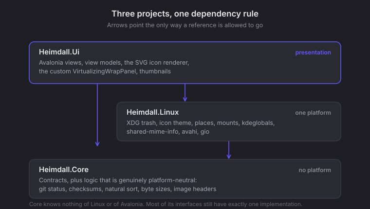
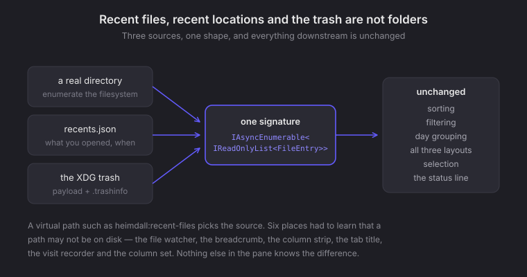

<div align="center">


# Heimdall

**A file manager for KDE that consumes the desktop instead of reimplementing it.**

Linux-first · C# · Avalonia 12 · .NET 10 · no runtime to install

</div>

---

Heimdall aims at parity with Dolphin, and it gets there by using what Plasma
already provides rather than building a parallel universe of settings. Your
colour scheme, icon theme, font, single-click preference, trash, bookmarks and
mounts are read from the same places KDE reads them. Change a theme and Heimdall
changes with it, without a restart.


<sub>Grid view at the filesystem root.</sub>

---

## Why it exists

Dolphin is very good. This is not a complaint-driven project — it is an attempt
to see whether a file manager can be built that is **fast at the sizes that
actually hurt**, **honest about what it does not know**, and **a good citizen of
the desktop it runs on**, without a settings dialog that reimplements the
control panel.

Three principles it has stuck to:

**Consume, do not reimplement.** Trash follows the freedesktop spec so files
deleted here appear in Dolphin's trash and vice versa. Bookmarks are the same
`user-places.xbel` Dolphin uses. Mime types come from `shared-mime-info`. Mounts
go through `gio`. Nothing here maintains its own parallel copy of desktop state.

**A wrong answer is worse than no answer.** The SVG icon renderer supports a
documented subset and *declines* anything it cannot draw correctly, falling back
to a generic icon rather than a mangled one. A failed version-control query
draws nothing rather than claiming everything is clean.

**Measure before believing.** Nearly every hard bug in this project was solved
by an instrument and none by inference. That habit is written into the codebase
as diagnostics you can switch on.

---

## What works

| | |
|---|---|
| **Three layouts** | a list with sortable columns, a compact multi-column view, and an icon grid |
| **Split view and tabs** | each side keeps its own selection, history and details panel |
| **Grid at any folder size** | a custom virtualizing wrap panel — 100,000 items in ~20 ms with 48 realized containers, constant regardless of folder size |
| **Recent files and locations** | Dolphin's two virtual listings, banded by day, with a Forget action |
| **Trash** | browse, restore and empty, reading the `.trashinfo` sidecars so restore knows where things came from |
| **Version control** | git status per folder — one subprocess per listing, never per row — marked `M A D ? !` in every layout, refreshed when you edit, commit or switch branch |
| **Tags** | stored as xattrs, shared with Dolphin |
| **Search** | streamed into the sidebar as results arrive |
| **Type-ahead, tab completion** | jump-to-letter in any listing; path completion in the location bar |
| **Checksums, batch rename, file sharing** | over the network via copyparty, if installed |
| **Themed** | colour scheme, accent, icon theme and font follow Plasma live |

Everything scales per pane — `Ctrl` with the wheel changes icon and font size on
the side under the pointer, independently of the other.

---

## Architecture



The dependency rule is the whole design. `Heimdall.Core` holds contracts and
logic that is genuinely platform-neutral. `Heimdall.Linux` holds everything that
knows what a `.desktop` file is. `Heimdall.Ui` holds Avalonia and nothing else
does.

Git decorations live in **Core**, not in `Heimdall.Linux`, because they drive the
`git` binary — which behaves the same on both target platforms. Putting them
beside the XDG trash would mean writing them twice.

### One shape for three sources



Recent files, recent locations and the trash are not directories, but they are
listings. Giving each a virtual path and returning the *same* enumerable shape as
the filesystem provider means sorting, filtering, grouping, all three layouts and
the selection machinery work on them with no special cases at all.

---

## Building

Short version, on Fedora:

```bash
sudo dnf install dotnet-sdk-10.0
git clone https://github.com/dkflint723/heimdall.git
cd heimdall
dotnet build && dotnet run --project src/Heimdall.Ui
```

Arch, prerequisites, the NativeAOT toolchain, the programs Heimdall shells out
to and how to hand someone a build: **[BUILDING.md](BUILDING.md)**.

> **Note** — `publish/` is the deliverable, not the executable alone.
> `libSkiaSharp.so` and `libHarfBuzzSharp.so` live beside the binary and are
> loaded from its own directory. "Self-contained" means no .NET runtime to
> install; it does not mean one file.

---

## Diagnostics

Off by default. Each prints to stderr.

| Variable | Prints |
|---|---|
| `HEIMDALL_TILE_DEBUG=1` | realized container count, index range and viewport per measure |
| `HEIMDALL_ICON_DEBUG=1` | per-shape bounds, brushes and gradient axes while rendering SVG icons |
| `HEIMDALL_LOAD_DEBUG=1` | heap, GC and thread-pool counters per folder load |
| `HEIMDALL_FONT_DEBUG=1` | font resolution |

`HEIMDALL_TILE_DEBUG` is the one to reach for when a listing feels slow. The
realized count is unambiguous in a way a timing figure is not — if it approaches
the item count, nothing is being virtualized.

---

## Status

Not released, and version numbers should not be trusted yet. The gaps below are
the honest list, not a roadmap.

**Known and open:**

- **Compact layout is not virtualized.** 100,000 items takes ~32 seconds there.
  It wraps into columns, so it needs an orientation mode on the panel. This is
  the only place Heimdall refuses something Dolphin does.
- **`git commit` and `git checkout` refresh the marks, but a submodule's does
  not.** A submodule or linked worktree keeps its `.git` as a *file* holding a
  gitdir pointer rather than a directory, so it is not watched and its marks wait
  for F5.
- Selection mode, configurable shortcuts and multi-window are unbuilt.
- **Windows is deliberately last.** Most Core interfaces still have exactly one
  implementation, and the second is where you find out which abstractions were
  really about Linux rather than about file management.

---

## Licence

MIT — see [LICENSE](LICENSE).

Heimdall builds on [Avalonia](https://avaloniaui.net) (MIT) and
[CommunityToolkit.Mvvm](https://github.com/CommunityToolkit/dotnet) (MIT), and
its published binaries bundle SkiaSharp and HarfBuzzSharp (MIT) and the Inter
typeface (SIL Open Font License 1.1).

---

<div align="center">
<sub>Named for the watchman who sees everything coming.</sub>
</div>
